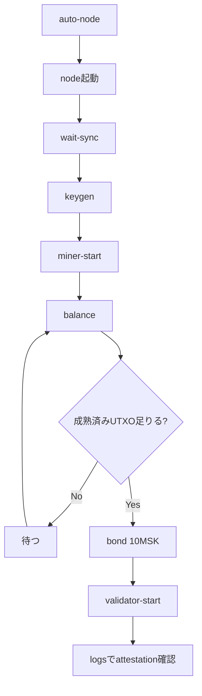

# MISAKA ローカルPC node参加

このフォルダは、VPSではなく **Mac / Linux / Windows WSL2 Ubuntu の中でMISAKA node自体を起動する** ための実験機能です。

公式`misakas` repositoryでは、このフォルダは`contrib/local-desktop-join`にあります。

VPS版との構成の違いは[`docs/design-ja.md`](docs/design-ja.md)を参照してください。

## 目的

参加ハードルを下げるため、VPSを用意しなくてもローカルPCだけで以下を試せるようにします。

- MISAKA source clone
- 必要toolchain準備
- `kaspad` / `misaka` / `kaspa-pq-validator` / `misaminer` build
- ローカルPC内で `kaspad` 起動
- node同期確認
- validator key作成
- funding miner起動
- Bond作成
- validator sidecar起動

## 重要な注意

ローカルPC運用は参加ハードルは低いですが、安定運用にはVPSの方が向いています。

ローカルPCの場合:

- PCをスリープするとnode/validator/minerが止まります
- 自宅回線やNAT環境では外部から `26211/tcp` へ接続されにくいです
- 公開peerとしてはVPSより弱いです
- 長期validator運用には常時起動が必要です
- Windows nativeではなく、まずはWSL2 Ubuntuを推奨します

この機能の位置づけ:

```text
参加体験を下げるためのローカル実験版
本番安定運用はVPS版が推奨
```

## 対応範囲

| 環境 | 状態 | 備考 |
| --- | --- | --- |
| macOS | 動作確認済み | Terminal / `.command` で起動 |
| Linux | 実装済み・実機未確認 | Ubuntu/Debian系を主対象 |
| Windows PowerShell + WSL2 Ubuntu | 実装済み・実機未確認 | `.cmd`から起動する推奨ルート |
| Windows WSL2 Ubuntu terminal | 実装済み・実機未確認 | 直接bashで実行する予備ルート |
| Windows native直接実行 | 未対応 | WSL2 Ubuntuを使用 |

## 一番短い使い方

macOS / Linux / WSL2 Ubuntu:

```bash
cd contrib/local-desktop-join
chmod +x scripts/misaka-desktop-node.sh
scripts/misaka-desktop-node.sh auto-node
```

ブラウザのWeb UIから進める場合:

```bash
cd contrib/local-desktop-join
chmod +x scripts/*.sh
scripts/misaka-desktop-web.sh
```

Ubuntu / Debian系Linuxでは、初回起動時に必要なpackageが不足している場合、Web UIを開く前にTerminalでsudo passwordを確認してpackageを導入します。

nodeが起動中なのにWeb UIが「node接続を確認する」のまま変わらない場合は、更新後にnodeを一度再起動してください。Local nodeはWeb UIの状態確認とvalidator操作に使うwRPC Borshを `127.0.0.1:27210` で明示的に起動します。

旧版で作成済みのBondがtxidだけで保存されている場合、validator起動時にStakeBondのoutput index `:0`を自動補正します。Bond transactionを作り直す必要はありません。

旧版でminer開始DAAが保存されていない場合は、既存minerログの最初の採掘DAAからcoinbase maturityの目安を復元します。

これは以下を行います。

```text
依存確認
Rust準備
misakas clone
release build
kaspad起動
node doctor表示
```

## Macでダブルクリック起動

Finderで以下をダブルクリックします。

```text
mac/start-misaka-local-node.command
```

VPS版に近いブラウザ操作で進める場合は、こちらを使います。

```text
mac/start-local-web-ui.command
```

このWeb UIはVPS版の画面構成に寄せています。

- setup画面
- 自動node setup
- 同期の動き
- validator準備
- miner / Bond操作
- dashboard画面
- 用語と仕組みの解説ページ
- 現在状態に合わせた「次に押すボタン」の1操作表示
- minerの採掘成功block数とcoinbase maturity目安
- validatorのattestation送信成功表示
- 状態とエラーを確認できる診断レポートのコピー / `.txt`保存

ローカル版では裏側の実行だけ `systemd` ではなく `scripts/misaka-desktop-node.sh` のPID管理になります。

Web UI右上またはsetup画面の「用語と仕組み」から、初心者向けの解説ページを開けます。
node、sync、DAA、UTXO、miner、coinbase maturity、Bond、validator、attestationなどを、現在の状態とつなげて確認できます。

ブラウザタブを閉じてしまった場合も、同じ `mac/start-local-web-ui.command` または `scripts/misaka-desktop-web.sh` をもう一度実行すると、起動中のWeb UIを検出して同じURLを開き直します。
新しいWeb UIを意図的に起動したい場合だけ、Terminalで `scripts/misaka-desktop-web.sh --force-new` を使います。

初回はセキュリティで止まる場合があります。
その場合はTerminalから実行してください。

```bash
cd contrib/local-desktop-join
chmod +x mac/start-misaka-local-node.command scripts/misaka-desktop-node.sh
mac/start-misaka-local-node.command
```

状態確認:

```text
mac/check-status.command
```

validator準備:

```text
mac/prepare-validator.command
```

全停止:

```text
mac/stop-all.command
```

Macではnode起動中、macOS標準の `caffeinate` を使ってスリープしにくくします。
無効にしたい場合は `MISAKA_KEEP_AWAKE=0` を付けて起動します。

## Windows PowerShell + WSL2 Ubuntu

Windowsでは、PowerShellからWSL2 Ubuntuを呼び出す入口を用意しています。

zip展開後、Explorerで以下をダブルクリックします。

```text
windows/start-web-ui-wsl.cmd
```

これはローカルWeb UIを起動し、Windowsのブラウザから操作できるようにします。

画面構成はVPS版と同じsetup/dashboardに寄せています。
裏側ではWSL2 Ubuntu内の `scripts/misaka-desktop-node.sh` を呼びます。

コマンドだけで進める場合:

```text
windows/start-node-wsl.cmd
```

状態確認:

```text
windows/check-status-wsl.cmd
```

validator準備:

```text
windows/prepare-validator-wsl.cmd
```

全停止:

```text
windows/stop-all-wsl.cmd
```

PowerShellから直接実行する場合:

```powershell
powershell -ExecutionPolicy Bypass -File .\windows\start-misaka-local-node-wsl.ps1 -Command auto-node
```

WSL2 Ubuntuがまだない場合:

```text
windows/install-ubuntu-wsl.cmd
```

詳しくは `windows/README-ja.md` を見てください。

## データ保存場所

デフォルト:

```text
~/.misaka-desktop-node/
```

中身:

```text
bin/              build済みバイナリ
misakas/          cloneしたsource
node-data/        kaspad appdir
validator/        validator key / state
logs/             kaspad / miner / validator logs
run/              PID files
state/            Web UI用の状態ファイル
```

場所を変える場合:

```bash
MISAKA_DESKTOP_HOME="$HOME/my-misaka-node" scripts/misaka-desktop-node.sh auto-node
```

## 主なコマンド

```bash
# 準備とbuild
scripts/misaka-desktop-node.sh prepare

# node起動
scripts/misaka-desktop-node.sh start-node

# node状態確認
scripts/misaka-desktop-node.sh status

# 詳細診断
scripts/misaka-desktop-node.sh doctor

# 状態とログを端末内へ保存する診断bundle作成
scripts/misaka-desktop-node.sh collect-diagnostic-log

# validator準備をまとめて進める
scripts/misaka-desktop-node.sh auto-validator

# 同期完了まで監視
scripts/misaka-desktop-node.sh wait-sync

# node停止
scripts/misaka-desktop-node.sh stop-node

# validator key作成
scripts/misaka-desktop-node.sh keygen

# funding miner起動
scripts/misaka-desktop-node.sh miner-start

# funding balance確認
scripts/misaka-desktop-node.sh balance

# Bond作成
scripts/misaka-desktop-node.sh bond 10MSK

# validator起動
scripts/misaka-desktop-node.sh validator-start

# 全停止
scripts/misaka-desktop-node.sh stop-all

# ログ確認
scripts/misaka-desktop-node.sh logs

# node / miner / validatorを個別に確認
scripts/misaka-desktop-node.sh node-logs
scripts/misaka-desktop-node.sh miner-logs
scripts/misaka-desktop-node.sh validator-logs
```

## 推奨フロー



## P2P受信について

ローカルPCが自宅回線の内側にある場合、外部peerからの接続は通常入りません。

それでもnodeは外向き接続で同期できます。
ただし「他人から接続されるseed/peer」としては弱くなります。

外部peerとしても見せたい場合:

- ルーターで `26211/tcp` をローカルPCへport forward
- PCのfirewallで `26211/tcp` を許可
- グローバルIPが変わる点に注意
