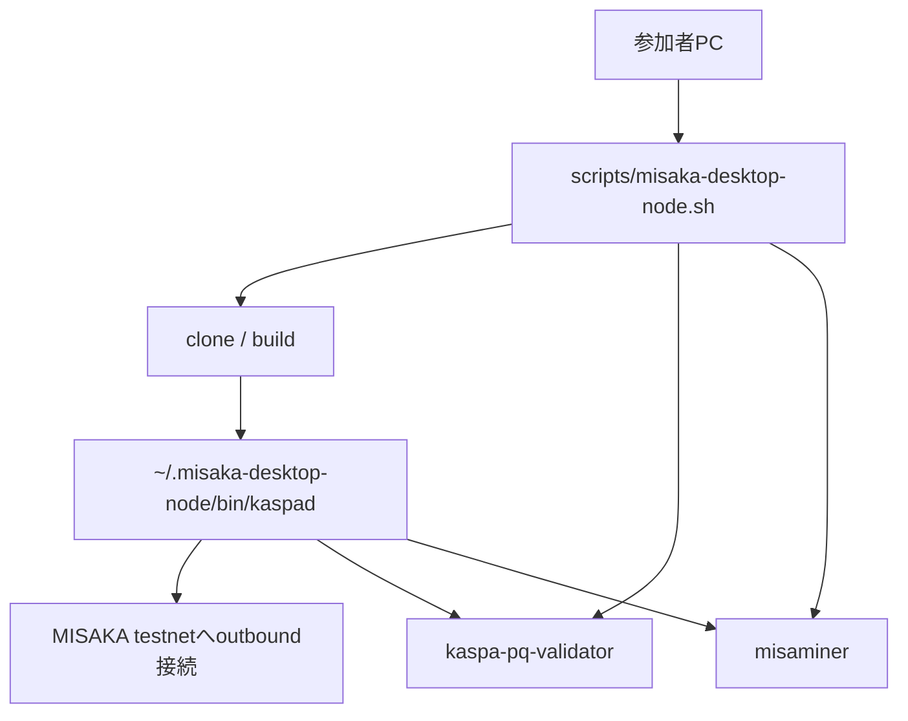
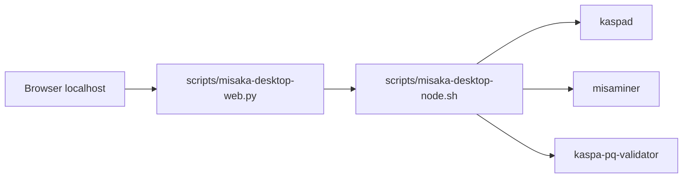

# ローカルPC node実行版の設計

## 既存VPS版との違い

| 項目 | VPS版 | ローカルPC版 |
| --- | --- | --- |
| 実行場所 | VPS | Mac / Linux / Windows WSL |
| サービス管理 | systemd | PIDファイル + background process |
| データ場所 | `/var/lib/misaka` | `~/.misaka-desktop-node` |
| バイナリ場所 | `/usr/local/bin` | `~/.misaka-desktop-node/bin` |
| firewall | UFW / panel firewall | ローカルOS firewall / ルーター |
| 24時間運用 | 向いている | PCスリープに弱い |
| P2P受信 | VPSなら容易 | NAT/port forwardが必要 |

## 実行イメージ

## 設計上の制約

- Windows nativeは対象外
- PowerShellからWSL2 Ubuntuを呼ぶ方式をWindows向けルートにする
- ローカルWeb UIを主導線にする
- CLI/ダブルクリックは予備導線として残す
- validator/minerは同じscriptの追加コマンドで扱う

## ローカルWeb UI

VPS版と同じく、参加者はブラウザ上のボタンで進める。

特徴:

- 既定では `127.0.0.1` だけで待ち受ける
- token付きURLを発行する
- ブラウザを閉じた場合、同じ起動scriptで起動中Web UIを再オープンする
- Mac / Linux / Windows WSL2で同じWeb UIを使う
- 画面はVPS版の `setup.html` / `dashboard.html` と同じ構成に寄せる
- 初心者が途中で意味を理解できるように `learn.html` を同梱する
- 実際のnode操作は既存の `misaka-desktop-node.sh` に集約する

## 初心者向け解説ページ

`ui/learn.html` は、setup/dashboardの補助ページとして扱う。

目的:

- 用語をその場で調べられる
- 現在の状態と用語をつなげる
- ログの読み方を初心者向けに示す
- 「残高はあるのにBondできない」など、誤解しやすい状態を先に説明する

主な構成:

- 今の自分の状態
- 参加の全体像
- 用語辞典
- ログの読み方
- 困った時の判断

このページは読み取り専用で、nodeやvalidatorの操作は行わない。
操作はsetup、確認はdashboard、理解補助はlearnに分ける。
